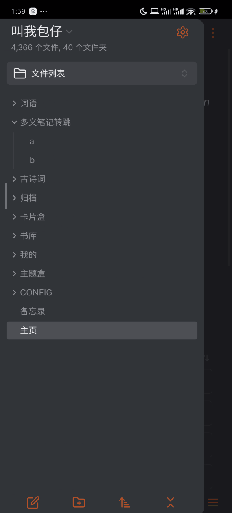

# obsidian-toolbox

# 读书

**可以在手机以及墨水屏阅读器上使用。**

在插件设置，阅读数据跟踪中指定文件夹（比如，`书库`），然后把转换好的 markdown 文件放入到 `书库` 中，为需要跟踪的书籍添加 `book` 标签，打开书籍，点击右上角的（铅笔）图标进入 `source view`，开始阅读吧。

- **转跳至上次阅读位置：** 请使用 `Remember cursor position` 插件。
- **翻页：** 点击下翻，左滑下翻，右滑上翻，长按0.5s进入编辑模式，收起软键盘进入阅读模式。
- **划线：** 如动图所示
- **查词：** 从汉典和百度百科爬取数据，点击`写生词`在`词语`文件夹下面创建一篇笔记；点击`写卡片`在 `卡片盒` 文件夹下面创建一篇笔记，如果 `卡片盒`以及子文件夹 `归档` 存在同名笔记会打开，而不是创建新的笔记。（日后，视情况开放指定文件夹的设置）
- **展示：** 点击书籍中的划线或出链会直接直接展示其内容
- **阅读数据跟踪：** 翻页后，会自动记录阅读时长（毫秒），格式化阅读时长（比如，3h21m35s），进度（比如：23.4），是否未读以及是否读完（当前日期）
- **同步读书笔记：**：同步所有书籍的划线，想法，书评（在文档属性中加入 `bookReview` 以及出链，在 `书库/读书笔记`中生成同步笔记。
- **阅读页面样式**：目前只能调整字体大小（仅影响书籍，不影响其他笔记）

# 密码创建器

# 多义笔记转跳 

在笔记属性中添加 `to: "[[filename or path]]`

# 脚注重编号

重新为当前文件中所有的脚注重新编号。

# 块引用

获取光标所在行（块）的双链，方便复制到地方使用。

# 查植物

从植物智爬取数据。
