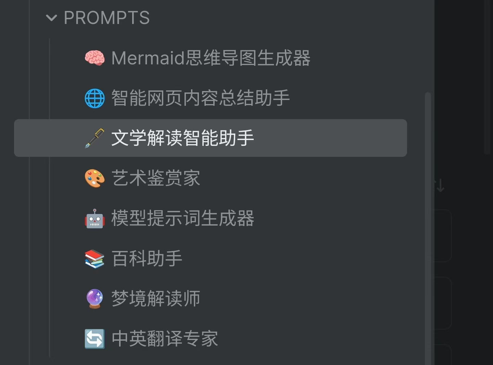

# obsidian-toolbox


# 阅读

**支持桌面端，移动端及墨水屏阅读器。**

1. 打开插件设置，在阅读数据跟踪中指定文件夹（比如，`书库`）
2. 在书籍中添加 `book` 标签，最后打开书籍
3. 点击右上角的（铅笔）图标进入 `source view`
4. 开始阅读吧

## 功能

- **转跳至上次阅读位置：** 使用 `Remember cursor position` 插件。
- **翻页：** 点击下翻，左滑下翻，右滑上翻，长按0.5s进入编辑模式，收起软键盘进入阅读模式。长按 2.5 秒切换全屏模式。
- **全屏模式:** 
- **划线：** 
- **讨论：** 梳理剧情，对话式问答，记录感悟与见解 
- **人物关系（beta）** 创建多个人物关系图
- **查词：** 从汉典和百度百科进行查词，（新增）AI 查词
- **展示：** 点击书籍中的划线或出链会直接直接展示其内容
- **阅读数据跟踪：** 跟踪阅读时长（毫秒），格式化阅读时长（比如，3h21m35s），进度（比如：23.4），是否未读以及是否读完（当前日期）
- **同步读书笔记：**：同步书籍的出链，划线，想法，评论以及书评（在文档属性中加入 `bookReview` ）
- **阅读页面样式**：调整字体大小


# AI Chat

支持 OpenAI SDK 接口的大模型。 *目前，仅测试了 deepseek*


- 内置提示词
  - 🎯 起标题：为当前笔记快速生成吸引人的标题
  - 📝 总结笔记：提取当前笔记的关键信息，生成简洁明了的摘要
  - [ ] 生成标签
  - [ ] 为笔记添加双链


- 自定义提示词（prompt）
- 笔记作为附件
- 自动保存对话历史
- 从对话历史中继续聊天
- 动作（Action）
- 自动补全：根据当前段落内容，自动补全接下来的笔记内容。桌面端按空格键补全建议内容插入到光标位置，移动端点击补全建议内容插入到光标位置。


笔记名为提示词（prompt）的名字，建议使用一个 emoji 开头。



```js
---
/*
temperature 偏好
- 代码生成/数学解题 0.0
- 数据抽取/分析	1.0
- 通用对话	1.3
- 翻译	1.3
- 创意类写作/诗歌创作	1.5
*/
temperature: 1
/*
选择一个默认的 action
在 AI Chat 页面可以随时更换其他的 action
- notSaveChat：不保存当前对话 
- replace：选中文本替换为第一个回答
- wikiLink: 选中文本替换为 wiki 链接（整个对话）
*/
action: 'default'
// 是否自动保存对话历史
save: true
// 最大 token 数
max_tokens: null
// 介于 -2.0 和 2.0 之间的数字。
// 如果该值为正，
// 那么新 token 会根据其是否已在已有文本中出现受到相应的惩罚
// 从而增加模型谈论新主题的可能性。
presence_penalty: 0
// 介于 -2.0 和 2.0 之间的数字。
// 如果该值为正，
// 那么新 token 会根据其在已有文本中的出现频率受到相应的惩罚，
// 降低模型重复相同内容的可能性。
frequency_penalty: 0
---

提示词内容
```


# 笔记加密

***请注意，本功能还处于测试阶段，请做好备份，避免因意外情况导致数据损坏或丢失。***

加密笔记中的文字，图片以及视频（默认不开启），加密后的资源文件覆盖源文件，也请做好备份。

支持桌面端和移动端。

- [ ] 独立页面（替换掉弹窗）
- [x] 图片压缩
- [ ] 视频压缩
- [ ] 行内加密（可以为某段文字，图片和视频加密，而不是全文）


# 海报

将视频第一帧作为海报。


# 密码创建器

随机创建一个强密码，用于注册账号

# 多义笔记转跳 

在笔记属性中添加 `to: "[[filename or path]]`

# 块引用

获取光标所在行（块）的双链，方便复制到地方使用。

# 画廊

```bash
# ```t-gallery
# path=CONFIG/GALLERY/影集/LIVE
# ```
```

# 读书笔记回顾

```bash
# ```t-review
# count=1
# ```
```


